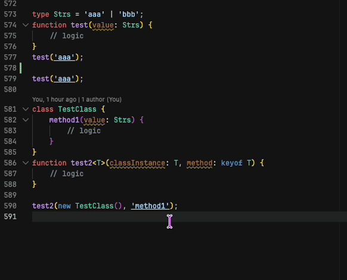

# String Jump

String Jump adds semantic navigation for strings and declaration names in TypeScript and JavaScript.

It is built on top of the TypeScript compiler and language-service model, so it follows real types, symbols, and declarations instead of regex rules or filename conventions.

Install from the [Visual Studio Marketplace](https://marketplace.visualstudio.com/items?itemName=MergeSoft.string-jump).

## What It Does

String Jump helps with two related workflows:

- Jump from a string literal to the declaration that gives that string meaning.
- Jump from a declaration name to the string literals and references that use it.

That means it can work both as forward navigation and as reverse navigation.

Examples it can resolve include:

- union-constrained string arguments
- route names
- controller tuple handlers
- controller class and method references
- model and query-builder string keys
- typed initializer and contextual typing cases

## Example

```ts
type Strs = 'aaa' | 'bbb';

function test(value: Strs) {
    // logic
}

test('aaa');
```

With the extension active:

- `F12` on `'aaa'` jumps to `type Strs = ...`
- `F12` on `Strs` can show the matching string usages

### Demo



## Supported Files

- TypeScript
- TypeScript React
- JavaScript
- JavaScript React

## Navigation Behavior

String Jump contributes its own `Go To Definition` command for supported JS and TS editors and binds it to `F12`.

For multiple matches, the extension defaults to peek behavior so the result list stays visible instead of jumping blindly to a single location.

Cmd-click and the standard `Go to Definition` flow also participate through the definition provider and TypeScript server plugin integration.

## Settings

The extension currently exposes two settings:

- `string-jump.hide-declaration`
  Hides the declaration under the cursor from reverse-definition results.
- `string-jump.hide-imports`
  Hides import statements from definition results.

Both default to `true`.

## Current Scope

- String Jump is semantic, not heuristic-first. It only decorates literals when it can resolve a concrete declaration target.
- It does not try to underline every string in a file.
- Results are strongest when TypeScript can describe the relationship through actual types, symbols, signatures, or declarations.
- The extension includes extra handling for a few practical framework-style patterns where plain TypeScript navigation is usually not enough.

## Development

```bash
npm install
npm run compile
```

Useful commands during development:

- `npm run compile` builds the extension and the bundled TypeScript server plugin package.
- `npm run watch` runs TypeScript in watch mode.
- `npm run package` creates a `.vsix` package.

Press `F5` in VS Code to launch an Extension Development Host.

## Local Validation

This repository uses a local harness instead of a VS Code integration test suite.

- `npm test` runs `test.ts`

The harness is meant for validating the resolver against a real local project. If you want to use it on your machine, create a `.env` file from `.env.example` and fill in the machine-specific values.

```bash
cp .env.example .env
```

Environment variables used by the local harness:

- `STRING_JUMP_TEST_TARGET`
  File, line, and column used by the direct resolver probe and optional editor-driven run.
- `STRING_JUMP_TEST_LOG_FILE`
  Path where the extension writes auto-test logs.
- `STRING_JUMP_COMMAND_SERVER_URL`
  Command bridge used only by the optional editor-driven flow.

`npm test` expects `.env` when no `--test=...` argument is provided.

The optional editor-driven path uses the VS Code extension [VSCode Command Server](https://marketplace.visualstudio.com/items?itemName=crimson206.vscode-command-server). You only need `STRING_JUMP_COMMAND_SERVER_URL` if you want the harness to restart the extension host and drive those extra steps.

## Packaging

```bash
npm run compile
npm run package
```

That produces a `.vsix` file ready for local install or Marketplace upload.
